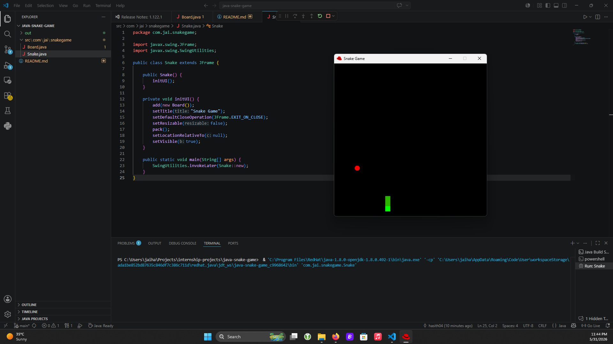

# Java Snake Game

A simple Snake game implemented in Java using Swing.

## Project Overview

This repository contains a lightweight Snake game: a playable grid-based game where the snake grows after eating apples and the player must avoid hitting the walls or its own tail.

## Features

- Classic Snake game mechanics
- Keyboard controls for movement
- Random apple placement
- Game over screen with restart support
- Built with Java Swing and AWT

## Files

- `src/com/jai/snakegame/Board.java` — game board, rendering, input handling, and game logic
- `src/com/jai/snakegame/Snake.java` — main application window and entry point

## Requirements

- Java 8 or newer
- A Java compiler and runtime (`javac`, `java`)

## Build and Run

From the project root:

```bash
javac -d out src\com\jai\snakegame\*.java
java -cp out com.jai.snakegame.Snake
```

## Controls

- `Arrow Keys` — move the snake
- `Enter` — restart the game after a game over

## Notes

- The game uses a timer to control the snake speed.
- The board size is `600x600` pixels, with each snake segment and apple sized `20x20` pixels.

## Screenshot


